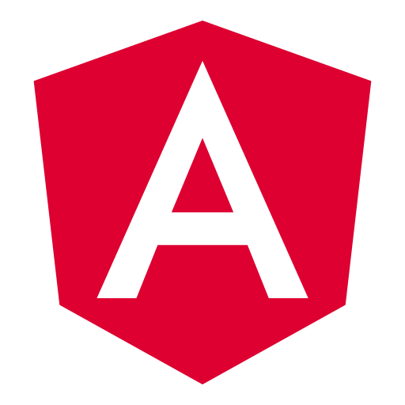
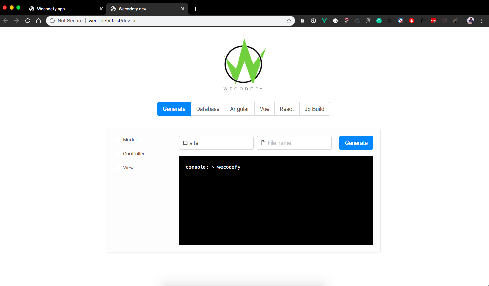
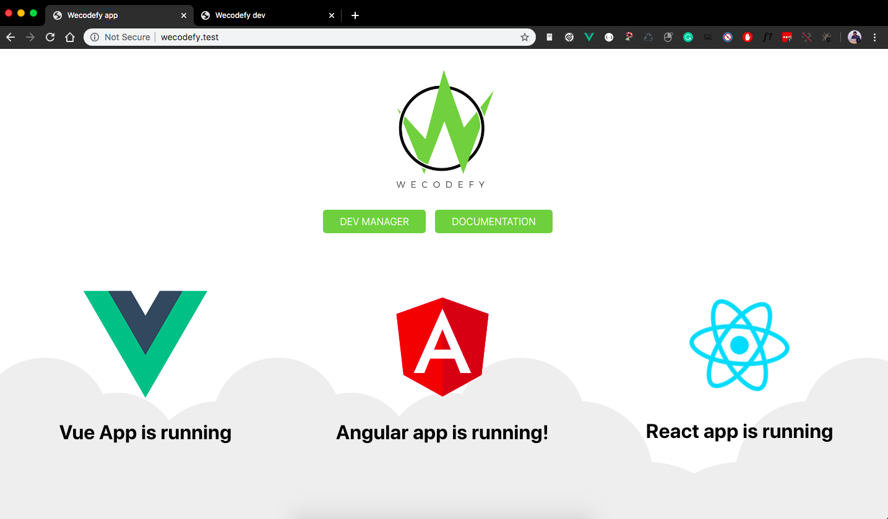
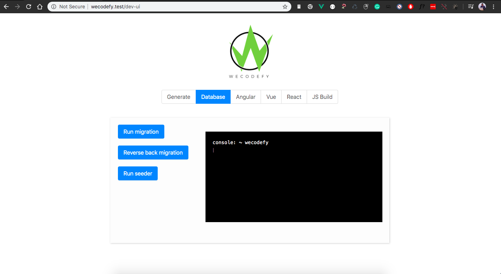
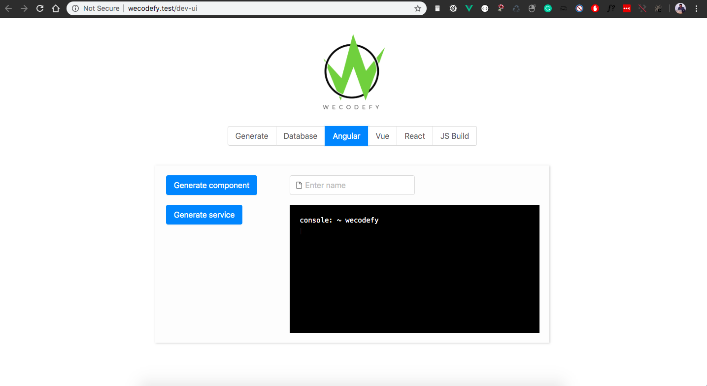
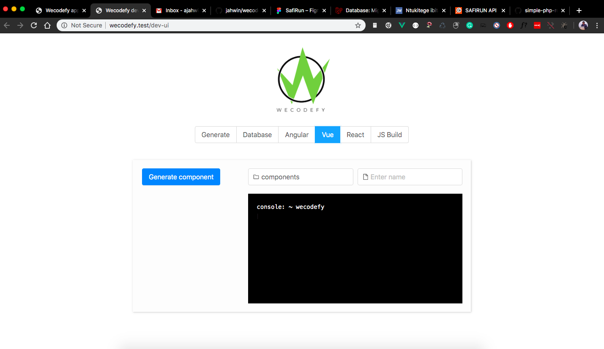
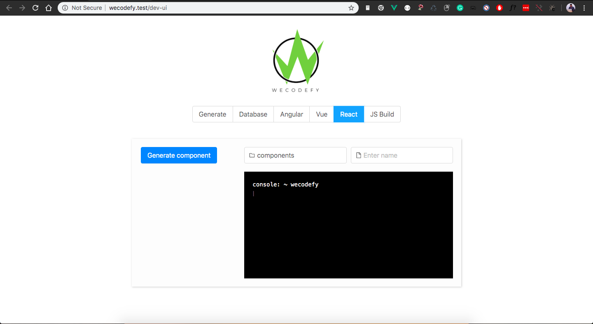
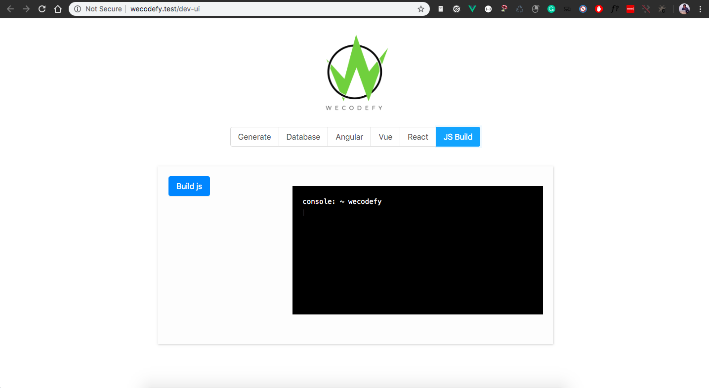

# WECODEFY WEB FRAMEWORK : Better v1.0

<p align="center"></p>

## About wecodefy
<p>Wecodefy is framework for making web application, It can be used to create Rest API and also you can build frontend by using modern javascript framework like Angular, React , Vue. if you are not familiar with those js framework you can use Twig templating engine.</p>

<p>This framework combine Angular, Vue ,React</p>
<p>



</p>

#### Wecodefy has Dev management tool
<p>By this tool you will be able to generate <b>Views</b>,<b>Controllers</b>,<b>Models</b>. Also this tool will be used to manage database by making migration and able to run seeder without commands, as it will be mentioned below.</p>
<p>
This tool will also able to generate Angular, Vue, React components, Then at end you can build your JavaScript codes<p>

<p>

</p>

# Documentation expectations
<p>We have made this documantation to be very simple to be understod even by those with little programming proficiency who want to make applications</p>


## Getting started :man_technologist:
<p>
After installation you will get this page:<br>

</p>

#### Requirement
- [x] <b>OS:</b> This framework can work on every operating system wich is able to run php script language.
- [x] <b>PHP:</b> php <= 7.2 is required  to run on this framework.
- [x] <b>Node:</b> v12.14.0 is required
- [x] <b>Npm:</b> v6.13.4 is required
- [x] <b>Composer:</b> Composer is required to install php packages
- [x] <b>Internet:</b> Internet will be used to install php and npm dependencies

#### Installation
<p>To install WeCodefy, first make sure that PHP and Node are installed in the local computer.
In case node is not installed in your computer click 
<a href="https://nodejs.org/en/download/" target="_brank">here</a> to install it.</p>

To check if PHP, node and npm, are sussesfully installed in your computer, run the following commands in your terminal or command prompty:<br>
``` 
# For checking php version
php -v 
```

``` 
# For checking node version
node -v 
```

``` 
# For checking npm version
npm -v 
```


### Servers that Wecodefy use
<p>You can run Wecodefy framework by using XAMP , WAMP, LAMP or PHP serve</p>
<p>Then after checking everything is fine, clone this  framework or download it from here </p>
<p>
<a target="_brank" href="https://github.com/jahwin/wecodefy/archive/v1.0.zip" class="wecodefy-btn">DOWNLOAD </a>
</p>
<p>After download extract downloaded zip file where you run web server projects [htdocs,www,...]. After extracting run the following commands:</p>

``` 
# This command is for installing  php composer packages
composer install
```

``` 
# This command is for installing  npm dependencies
npm install
```

:runner::runner::runner::runner::runner::runner: Now you are able to go, If you are using XAMP, WAMP, LAMP you can direct run your project.

<p>If you want to use php server, use the following command:</p>


``` 
# This command is for running php server
php run serve
```

<p>After running your project you will get Starter page we mensioned above.</p>

## Lets talk about wecodefy structure
<p>
  This is nomal MVC pattern based, That means you can deal with Views, Controllers and Models
</p>


- [x] <b>Views:</b> This is where your will put your desing thinking
- [x] <b>Controllers:</b> This is where your will put your bussiness logics
- [x] <b>Models:</b> This is where your will manage your data from database

But there is something we have to talk about called <b>Routing</b>

## Routing
<p>This routing functionality will help you to map URL with defferent options like controller and call some functions, Lets take look on some examples</p>

You will config routing in the directory below:
```
/config/routes.php
```
Here you fill you route in array inside that file.

```php
$routes = [
    [
        'path' => '/',
        'method' => 'GET',
        'folder' => 'site',
        'return' => 'Home@welcome',
    ],
    [
        'path' => '/api',
        "children" => [
            [
                'path' => '/',
                'method' => 'GET',
                'folder' => 'api',
                'return' => 'Home@welcome',
            ],
        ],

    ],
]
```

Lets understund the code above :point_up_2:
 
 <b>path:</b> key in array this where your will put your path url,
 you can also get data from path see example below:
 

```php
$routes = [
    [
        'path' => '/info/{name}',
        'method' => 'GET',
        'folder' => 'site',
        'return' => function ($name) {
            echo 'Hello ' . $name;
        },
    ]
]
#You can use name as arguments in function.
```
 <b>method:</b> key in array this where your will put request method,
 POST, GET, PUT, DELETE, OPTIONS, PATCH

  <b>folder:</b> key in array this where your will put folder name where controller is located.
```
app/http/[folder name]/controllers/home.php
```
That means you have to use folder name based on folder of your controller are saved to.

 <b>return:</b> key in array this where your will return anything you want.
 ```
 className@funtionName
 ```
 Class name must have the same name with controller file name.

 ### Group routing
 You can also group routes on and prefix path.

 ```php
$routes = [
    [
        'path' => '/api',
        "children" => [
            [
                'path' => '/',
                'method' => 'GET',
                'folder' => 'api',
                'return' => 'Home@welcome',
            ],
        ],

    ],
]
 ```

## Middleware
You can setup different autholization on your routes. The thing you only need is to add `middleware` key on your any routes:

```php
$routes = [
    [
        'path' => '/',
        'method' => 'GET',
        'folder' => 'site',
        'middleware' => 'web',
        'return' => 'Home@welcome',
    ]
]
```
The you can set value initialized in `config/middleware.php`.

```php
<?php
$middleware = [
    "web" => app\middlewares\AuthMiddleware::class, 
]
?>
```

Middleware files found in  `app/middlewares` folder,
So then your middleware class look like this.

```php
<?php
namespace app\middlewares;

use Pecee\Http\Middleware\IMiddleware;
use Pecee\Http\Request;

class AuthMiddleware implements IMiddleware
{

    public function handle(Request $request): void
    {
        $user = "";
        // If authentication failed, redirect request to 404 page.
        if ( $user === null) {
            responce("",404);
        }

    }

}
  ?>
```

## Controllers
<p>This is were you will put your bussiness logics, see directory below to see were it can be created manual.</p>

```
app/http/[folder name]/controllers/
```

This is example of how it look like:
```
# This is file name
home.php
```

```php
<?php
namespace app\http\site\controllers;

use app\models\Home as HomeModel;
use system\library\Controller;


class Home extends Controller
{
    public function __construct()
    {
        parent::__construct();
    }

    public function welcome()
    {
        $data = array("name"=>"Hello world");
        // Load template from `app/http/site/views/home/index.twig`
        return $this->render('site', 'home/index.twig', $data);
    }

}

```

## Views
<p>This is were you will put your design thinking.</p>

```
app/http/[folder name]/views/
```

This is example of how it look like:
```
# This is file name
home.twig
```

```twig
<!DOCTYPE html>
<html>
	<head>
		<meta charset="utf-8">
		<title>Wecodefy app</title>
		<base href="{{'APP_URL' | env}}">
		<meta name="theme-color" content="#000000"/>
		<meta name="viewport" content="width=device-width, initial-scale=1">
        </head>

	<body>
      <h1>{{name}}</h1>
    </body>
</html>
```
For more information about using twig tamplating  refer to <a target="_brank" href="https://twig.symfony.com/doc/2.x/"> this</a>

## Models
<p>This is were you will get data from database and that data will be processed on controller then will be viewed on views.</p>

```
app/models
```

This is example of how it look like:
```
# This is file name
user.php
```

```php
<?php
namespace app\models; 

use system\library\Models;
use system\library\DB;

class User extends Models {
    // This will allow to get all users in users table
    public function getAllUser() {
        $data = DB::table( 'users' )
        ->orderBy( 'id', 'desc' )->get();
        return $data;
    }
}
?>
```

For more information about Query Builder refer to <a href="https://laravel.com/docs/5.8/queries">this</a>

# You can generate Models,Views,Controller by using Dev Management Tool
```
# Use this url and make sure your app is in developement mode [.env]

http://{app_url}/dev-ui
```
<p>

</p>

# Database
Here we are going to talk about database connetion, migration and seeding.

## Database connetion
You have to set database connetion in .env file if not exist create it, this file must have the same content with .env.example, so then you can set you database connetion

```
# This is database .env variable

DATABASE_HOST = 127.0.0.1
DATABASE_NAME = db_wecodefy
DATABASE_PREFIX = tb
DATABASE_USER = root
DATABASE_PASS = 12345
```
## Database migration
This the way of manipurating database schema. You don't neen to generate every file that can be used for making migration.

```
# Use this file located here
config/migration.php
```

Let see how it works.

```php
<?php
use Illuminate\Database\Schema\Blueprint;
/**
* --------------------------------------------
* Setting up database
* -------------------------------------------
* Don't change this variable name
*/
$db_up_migration = [
    [
        "key" => 1,
        "table"=>"tb_client",
        "todo" =>"create",
        "run" => function( Blueprint $table ) {
            $table->string( "email" )->index();
            $table->string( "token" )->index();
            $table->timestamps();
        },
        "reason"=>"Creating tb_client table"
    ],
    [
        "key" => 2,
        "table"=>"tb_books",
        "todo" =>"create",
        "run" => function( Blueprint $table ) {
            $table->string( "name" )->index();
            $table->timestamps();
        },
        "reason"=>"Creating tb_books table"
    ],
    [
        "key" => 3,
        "table"=>"tb_books",
        "todo" =>"rename",
        "run" => "tb_book",
        "reason"=>"Reaname tb_books to tb_book table"
    ]

];

/**
* --------------------------------------------
* Rollback database
* -------------------------------------------
* Don't change this variable name
*/
$db_down_migration = [
    [
        "key" => 1,
        "table"=>"tb_client",
        "todo" =>"delete",
        "run" => "drop",
        "reason"=>"Removing tb_client table"
    ],
    [
        "key" => 2,
        "table"=>"tb_book",
        "todo" =>"delete",
        "run" => "drop",
        "reason"=>"Removing tb_book table"
    ]
];

?>
```

Let's undestund the above code:

- [x] <b>key:</b> This is the unique identifyer for that migration
- [x] <b>table:</b> This is the name of table that effect will take off.
- [x] <b>todo:</b> This is the action will take place
     - create : This will be only used to create table with its fields
     - update : This will be only used to update fields structure in table
     - delete : This will be only used to delete table
     - rename : This will be only used to rename table
- [x] <b>run:</b> This is what will be executed, but there are something you have to pay atention.
    - if you want to rename table you have to enter table name here.
    - If you want to drop table you have to enter 'drop' keyword.
    - If you want create or update table you have to use  Blueprint function initialization
- [x] <b>reason:</b> This is the reason you are making that migration.

For more about creating or updating table columns refer to <a href="https://laravel.com/docs/5.8/migrations#creating-columns"> this </a>

# Seeding

This is the way of auto entering fake data into the database, here we use `Faker\Factory` namespace to auto generate some information.

```
# Use this file located here
config/seeder.php
```

Let see how it works.

```php
<?php
use Faker\Factory;
$generate = Factory::create();
/**
* --------------------------------------------
* Enserting fake data in database
* -------------------------------------------
* Don't change this variable name
*/
$database_seeder = [
    [
        'table' => 'user',
        'rows' => 10,
        'fields'=> function() use($generate){
            return  [
                'first_name' =>   $generate->name,
                'last_name'=>   $generate->name,
                'email' =>   $generate->email,
                'password' =>  $generate->password,
            ];
        }
    ]
];
?>
```

## This is a list of generator


##### `Basic generator`
```php
    $generate->randomDigit;            // 7
    $generate->randomDigitNot(5);      // 0, 1, 2, 3, 4, 6, 7, 8, or 9
    $generate->randomDigitNotNull;      // 5
    $generate->randomNumber($nbDigits = NULL, $strict = false); // 79907610
    $generate->randomFloat($nbMaxDecimals = NULL, $min = 0, $max = NULL); // 48.8932
    $generate->numberBetween($min = 1000, $max = 9000); // 8567
    $generate->randomLetter;// 'b'
    // returns randomly ordered subsequence of a provided array
    $generate->randomElements($array = array ('a','b','c'), $count = 1); // array('c')
    $generate->randomElement($array = array ('a','b','c')); // 'b'
    $generate->shuffle('hello, world'); // 'rlo,h eoldlw'
    $generate->shuffle(array(1, 2, 3)); // array(2, 1, 3)
    $generate->numerify('Hello ###'); // 'Hello 609'
    $generate->lexify('Hello ???'); // 'Hello wgt'
    $generate->bothify('Hello ##??'); // 'Hello 42jz'
    $generate->asciify('Hello ***'); // 'Hello R6+'
    $generate->regexify('[A-Z0-9._%+-]+@[A-Z0-9.-]+\.[A-Z]{2,4}'); // sm0@y8k96a.ej
```

##### `Lorem generator`
```php
    $generate->word;                                             // 'aut'
    $generate->words($nb = 3, $asText = false);                  // array('porro', 'sed', 'magni')
    $generate->sentence($nbWords = 6, $variableNbWords = true);  // 'Sit vitae voluptas sint non voluptates.'
    $generate->sentences($nb = 3, $asText = false);              // array('Optio quos qui illo error.', 'Laborum vero a officia id corporis.', 'Saepe provident esse hic eligendi.')
    $generate->paragraph($nbSentences = 3, $variableNbSentences = true); // 'Ut ab voluptas sed a nam. Sint autem inventore aut officia aut aut blanditiis. Ducimus eos odit amet et est ut eum.'
    $generate->paragraphs($nb = 3, $asText = false);             // array('Quidem ut sunt et quidem est accusamus aut. Fuga est placeat rerum ut. Enim ex eveniet facere sunt.', 'Aut nam et eum architecto fugit repellendus illo. Qui ex esse veritatis.', 'Possimus omnis aut incidunt sunt. Asperiores incidunt iure sequi cum culpa rem. Rerum exercitationem est rem.')
    $generate->text($maxNbChars = 200);                          // 'Fuga totam reiciendis qui architecto fugiat nemo. Consequatur recusandae qui cupiditate eos quod.'
```


##### `en_US Person generator`

```php
    $generate->title($gender = null|'male'|'female');     // 'Ms.'
    $generate->titleMale;                                 // 'Mr.'
    $generate->titleFemale;                               // 'Ms.'
    $generate->suffix;                                    // 'Jr.'
    $generate->name($gender = null|'male'|'female');      // 'Dr. Zane Stroman'
    $generate->firstName($gender = null|'male'|'female'); // 'Maynard'
    $generate->firstNameMale;                             // 'Maynard'
    $generate->firstNameFemale;                           // 'Rachel'
    $generate->lastName;                                  // 'Zulauf'
```

##### `en_US Address generator`

```php
    $generate->cityPrefix;                          // 'Lake'
    $generate->secondaryAddress;                    // 'Suite 961'
    $generate->state;                               // 'NewMexico'
    $generate->stateAbbr;                           // 'OH'
    $generate->citySuffix;                          // 'borough'
    $generate->streetSuffix;                        // 'Keys'
    $generate->buildingNumber;                      // '484'
    $generate->city;                                // 'West Judge'
    $generate->streetName;                          // 'Keegan Trail'
    $generate->streetAddress;                       // '439 Karley Loaf Suite 897'
    $generate->postcode;                            // '17916'
    $generate->address;                             // '8888 Cummings Vista Apt. 101, Susanbury, NY 95473'
    $generate->country;                             // 'Falkland Islands (Malvinas)'
    $generate->latitude($min = -90, $max = 90);     // 77.147489
    $generate->longitude($min = -180, $max = 180);  // 86.211205
```

##### `en_US PhoneNumber generator`

```php
    $generate->phoneNumber;             // '201-886-0269 x3767'
    $generate->tollFreePhoneNumber;     // '(888) 937-7238'
    $generate->e164PhoneNumber;     // '+27113456789'
```

##### `en_US Company generator`

```php
    $generate->catchPhrase;             // 'Monitored regional contingency'
    $generate->bs;                      // 'e-enable robust architectures'
    $generate->company;                 // 'Bogan-Treutel'
    $generate->companySuffix;           // 'and Sons'
    $generate->jobTitle;                // 'Cashier'
```

##### `en_US Text generator`

```php
    $generate->realText($maxNbChars = 200, $indexSize = 2); // "And yet I wish you could manage it?) 'And what are they made of?' Alice asked in a shrill, passionate voice. 'Would YOU like cats if you were never even spoke to Time!' 'Perhaps not,' Alice replied."
```

##### `DateTime generator`
```php
    $generate->unixTime($max = 'now');                // 58781813
    $generate->dateTime($max = 'now', $timezone = null); // DateTime('2008-04-25 08:37:17', 'UTC')
    $generate->dateTimeAD($max = 'now', $timezone = null); // DateTime('1800-04-29 20:38:49', 'Europe/Paris')
    $generate->iso8601($max = 'now');                 // '1978-12-09T10:10:29+0000'
    $generate->date($format = 'Y-m-d', $max = 'now'); // '1979-06-09'
    $generate->time($format = 'H:i:s', $max = 'now'); // '20:49:42'
    $generate->dateTimeBetween($startDate = '-30 years', $endDate = 'now', $timezone = null); // DateTime('2003-03-15 02:00:49', 'Africa/Lagos')
    $generate->dateTimeInInterval($startDate = '-30 years', $interval = '+ 5 days', $timezone = null); // DateTime('2003-03-15 02:00:49', 'Antartica/Vostok')
    $generate->dateTimeThisCentury($max = 'now', $timezone = null);     // DateTime('1915-05-30 19:28:21', 'UTC')
    $generate->dateTimeThisDecade($max = 'now', $timezone = null);      // DateTime('2007-05-29 22:30:48', 'Europe/Paris')
    $generate->dateTimeThisYear($max = 'now', $timezone = null);        // DateTime('2011-02-27 20:52:14', 'Africa/Lagos')
    $generate->dateTimeThisMonth($max = 'now', $timezone = null);       // DateTime('2011-10-23 13:46:23', 'Antarctica/Vostok')
    $generate->amPm($max = 'now');                    // 'pm'
    $generate->dayOfMonth($max = 'now');              // '04'
    $generate->dayOfWeek($max = 'now');               // 'Friday'
    $generate->month($max = 'now');                   // '06'
    $generate->monthName($max = 'now');               // 'January'
    $generate->year($max = 'now');                    // '1993'
    $generate->century;                               // 'VI'
    $generate->timezone;                             // 'Europe/Paris'
```

##### `Internet generator`
```php
    $generate->email;                  // 'tkshlerin@collins.com'
    $generate->safeEmail;               // 'king.alford@example.org'
    $generate->freeEmail;               // 'bradley72@gmail.com'
    $generate->companyEmail;            // 'russel.durward@mcdermott.org'
    $generate->freeEmailDomain;         // 'yahoo.com'
    $generate->safeEmailDomain;         // 'example.org'
    $generate->userName;                // 'wade55'
    $generate->password;                // 'k&|X+a45*2['
    $generate->domainName;              // 'wolffdeckow.net'
    $generate->domainWord;              // 'feeney'
    $generate->tld;                     // 'biz'
    $generate->url;                     // 'http://www.skilesdonnelly.biz/aut-accusantium-ut-architecto-sit-et.html'
    $generate->slug;                    // 'aut-repellat-commodi-vel-itaque-nihil-id-saepe-nostrum'
    $generate->ipv4;                    // '109.133.32.252'
    $generate->localIpv4;               // '10.242.58.8'
    $generate->ipv6;                    // '8e65:933d:22ee:a232:f1c1:2741:1f10:117c'
    $generate->macAddress;              // '43:85:B7:08:10:CA'
```

##### `UserAgent generator`
```php
    $generate->userAgent;              // 'Mozilla/5.0 (Windows CE) AppleWebKit/5350 (KHTML, like Gecko) Chrome/13.0.888.0 Safari/5350'
    $generate->chrome;                 // 'Mozilla/5.0 (Macintosh; PPC Mac OS X 10_6_5) AppleWebKit/5312 (KHTML, like Gecko) Chrome/14.0.894.0 Safari/5312'
    $generate->firefox;                // 'Mozilla/5.0 (X11; Linuxi686; rv:7.0) Gecko/20101231 Firefox/3.6'
    $generate->safari;                 // 'Mozilla/5.0 (Macintosh; U; PPC Mac OS X 10_7_1 rv:3.0; en-US) AppleWebKit/534.11.3 (KHTML, like Gecko) Version/4.0 Safari/534.11.3'
    $generate->opera;                  // 'Opera/8.25 (Windows NT 5.1; en-US) Presto/2.9.188 Version/10.00'
    $generate->internetExplorer;       // 'Mozilla/5.0 (compatible; MSIE 7.0; Windows 98; Win 9x 4.90; Trident/3.0)'
```

##### `Payment generator`
```php
    $generate->creditCardType;          // 'MasterCard'
    $generate->creditCardNumber;        // '4485480221084675'
    $generate->creditCardExpirationDate; // 04/13
    $generate->creditCardExpirationDateString; // '04/13'
    $generate->creditCardDetails;       // array('MasterCard', '4485480221084675', 'Aleksander Nowak', '04/13')
    // Generates a random IBAN. Set $countryCode to null for a random country
    $generate->iban($countryCode);      // 'IT31A8497112740YZ575DJ28BP4'
    s$generate->wiftBicNumber;          // 'RZTIAT22263'
```

##### `Color generator`
```php
    $generate->hexcolor;               // '#fa3cc2'
    $generate->rgbcolor;               // '0,255,122'
    $generate->rgbColorAsArray;        // array(0,255,122)
    $generate->rgbCssColor;            // 'rgb(0,255,122)'
    $generate->safeColorName;          // 'fuchsia'
    $generate->colorName;              // 'Gainsbor'
    $generate->hslColor;               // '340,50,20'
    $generate->hslColorAsArray;       // array(340,50,20)
```

##### `File  generator`
```php
    $generate->fileExtension;          // 'avi'
    $generate->mimeType;               // 'video/x-msvideo'
    // Copy a random file from the source to the target directory and returns the fullpath or filename
    $generate->file($sourceDir = '/tmp', $targetDir = '/tmp'); // '/path/to/targetDir/13b73edae8443990be1aa8f1a483bc27.jpg'
    $generate->file($sourceDir, $targetDir, false); // '13b73edae8443990be1aa8f1a483bc27.jpg'
```

##### `Image generator`
```php
    // Image generation provided by LoremPixel (http://lorempixel.com/)
    $generate->imageUrl($width = 640, $height = 480); // 'http://lorempixel.com/640/480/'
    $generate->imageUrl($width, $height, 'cats');     // 'http://lorempixel.com/800/600/cats/'
    $generate->imageUrl($width, $height, 'cats', true, 'Faker'); // 'http://lorempixel.com/800/400/cats/Faker'
    $generate->imageUrl($width, $height, 'cats', true, 'Faker', true); // 'http://lorempixel.com/gray/800/400/cats/Faker/' Monochrome image
    $generate->image($dir = '/tmp', $width = 640, $height = 480); // '/tmp/13b73edae8443990be1aa8f1a483bc27.jpg'
    $generate->image($dir, $width, $height, 'cats');  // 'tmp/13b73edae8443990be1aa8f1a483bc27.jpg' it's a cat!
    $generate->image($dir, $width, $height, 'cats', false); // '13b73edae8443990be1aa8f1a483bc27.jpg' it's a filename without path
    $generate->image($dir, $width, $height, 'cats', true, false); // it's a no randomize images (default: `true`)
    $generate->image($dir, $width, $height, 'cats', true, true, 'Faker'); // 'tmp/13b73edae8443990be1aa8f1a483bc27.jpg' it's a cat with 'Faker' text. Default, `null`.
```
##### `Uuid  generator`
```php
    $generate->uuid;                   // '7e57d004-2b97-0e7a-b45f-5387367791cd'
```

##### `Barcode generator`
```php
    $generate->ean13;         // '4006381333931'
    $generate->ean8;           // '73513537'
    $generate->isbn13;         // '9790404436093'
    $generate->isbn10;         // '4881416324'
```

##### `Miscellaneous generator`
```php
    $generate->boolean; // false
    $generate->boolean($chanceOfGettingTrue = 50); // true
    $generate->md5;           // 'de99a620c50f2990e87144735cd357e7'
    $generate->sha1;          // 'f08e7f04ca1a413807ebc47551a40a20a0b4de5c'
    $generate->sha256;        // '0061e4c60dac5c1d82db0135a42e00c89ae3a333e7c26485321f24348c7e98a5'
    $generate->locale;        // en_UK
    $generate->countryCode;   // UK
    $generate->languageCode;  // en
    $generate->currencyCode;  // EUR
    $generate->emoji;         // 😁
```

##### `Biased generator`
```php
    // get a random number between 10 and 20,
    // with more chances to be close to 20
    $generate->biasedNumberBetween($min = 10, $max = 20, $function = 'sqrt');
```

##### `HtmlLorem generator`
```php
    //Generate HTML document which is no more than 2 levels deep, and no more than 3 elements wide at any level.
    $generate->randomHtml(2,3);   // <html> content .... </html>
```

# You can run migration and seeding by using Dev Management Tool
```
# Use this url and make sure your app is in developement mode [.env]

http://{app_url}/dev-ui
```
<p>

</p>

# Lets talk about some important functionality

## Cookies
If you want to use cookies you have to use `system\library\Cookies` namespace.

This some cookies important functions:
```php
// Allow to add cookie
Cookies::add($key, $value, $day);
// Allow to get cookie
Cookies::get($key)
// Allow to delete cookie
Cookies::delete($key)
// Allow to check if cookie is enabled
Cookies::check()
```

## Session
If you want to use session you have to use `system\library\Session` namespace.

This some cookies important functions:
```php
// Allow to start session
Session::init();
// Allow to create session item
Session::add($key, $value);
// Allow to get session item
Session::get($key);
// Allow to delete session item
Session::delete($key);
// Allow to destroy all session
Session::destroy()
```

## Upload
If you want to use session you have to use `system\library\Upload` namespace.

```php
$uploaded = Upload::dir('/assets/images/')->param('files'->randomName(true)->start();
return json_encode($uploaded);
```
This is returned result after upload:
```json
[{
    "name": "file_name.jpeg",
    "size": 77164,
    "type": "image/jpeg",
    "realname": "file_name.jpeg",
    "url": "http://wecodefy.test/assets/images/file_name.jpeg"
}]
```

## Send email 
If you want to send email you have to use `system\library\Email` namespace.

```php
$email = new Email();
$email->init($host, $username, $password, $is_html = false, $security = 'ssl', $port = 465);
$email->from($email, $name);
$email->to($email, $name);
$email->template($subject, $title, $body);
$email->sendEmail();
```
## Localization 
If you want to translate your app you have to use `system\library\Lang` namespace.
First you have to config language settings in `.env`.

```
# database or file
LANGUAGE_STORAGE = file

# Default locale
DEFAULT_LANGUAGE = en-us

#Allow for auto save in file or database in default locale
LANGUAGE_AUTO_SAVE = true
```

How to change locale?

```php
 Lang::init()->setLocale('fr-fr');
```
<p>
   This the way of making transilation in your different keywords:
<p>

```php
// In php functions
$translated = Lang::init()->Trans($text)
```

```twig
<!-- In twig templating -->

<!DOCTYPE html>
<html>
	<head>
		<meta charset="utf-8">
		<title>Wecodefy app</title>
		<base href="{{'APP_URL' | env}}">
		<meta name="viewport" content="width=device-width, initial-scale=1">
        </head>

	<body>
      <h1>{{'Hello' | translate}}</h1>
    </body>
</html>
```

All keyword will be saved automatical  in default locale file or database based on your localization settings.

```php
// In file
 <?php
$keywords = array(
    'Hello' => 'Hello',
    'ToDay' => 'ToDay',
    'Morning' => 'Morning',
    'Night' => 'Night',
);
```

In database all keywords will be saved in  `lang-keywords` table.

##### Getting language index

```php
 $langList = Lang::init()->getLangIndex();
```
This will return array of languages fund in `config/lang.php` or database in `lang-index` based on `LANGUAGE_STORAGE` setting.

## Cors
Now you can set your cors settings in `config/cors.php`

```php
$cols->init([
    'allowedOrigins' => '*',
    'allowedMethods' => 'POST, DELETE, PUT, PATCH, OPTIONS',
    'allowedHeaders' => 'Content-Type, Authorization, X-Requested-With',
    'maxAge' => 10000,
]);
```
## FlashData
This is an option of storing data and get destroyed when used. you can use `system\library\FlashData` namespace

```php
// Allow to add flashdata
FlashData::Add($key, $data);

// Get that data and get destroyed
FlashData::Get($key);
```

# Some usefull functions

## Urls

By default all controller and resource routes will use a simplified version of their url as name.

You easily use the `url()` shortcut helper function to retrieve urls for your routes or manipulate the current url.

`url()` will return a `Url` object which will return a `string` when rendered, so it can be used safely in templates etc. but 
contains all the useful helpers methods in the `Url` class like `contains`, `indexOf` etc. 


### Get the current url

It has never been easier to get and/or manipulate the current url.

The example below shows you how to get the current url:

```php
# output: /current-url
url();
```

### Get by name (single route)

```php
# output: /product-view/22/?category=shoes
url('product', ['id' => 22], ['category' => 'shoes']);

# output: /product-view/?category=shoes
url('product', null, ['category' => 'shoes']);
```

### Get by name (controller route)

```php

# output: /images/view/?category=shows
url('picture@getView', null, ['category' => 'shoes']);

# output: /images/view/?category=shows
url('picture', 'getView', ['category' => 'shoes']);

# output: /images/view/
url('picture', 'view');
```

### Get by class

```php
# output: /product-view/22/?category=shoes
url('ProductsController@show', ['id' => 22], ['category' => 'shoes']);

# output: /images/image/?id=22
url('ImagesController@getImage', null, ['id' => 22]);
```

### Using custom names for methods on a controller/resource route

```php
url('gadgets.iphone');
# output
# /gadgets/iphoneinfo/
```

### Manipulating url
You can easily manipulate the query-strings, by adding your get param arguments.

```php
# output: /current-url?q=cars

url(null, null, ['q' => 'cars']);
```

You can remove a query-string parameter by setting the value to `null`. 

The example below will remove any query-string parameter named `q` from the url but keep all others query-string parameters:

```php
$url = url()->removeParam('q');
```


### Useful url tricks

Calling `url` will always return a `Url` object. Upon rendered it will return a `string` of the relative `url`, so it's safe to use in templates etc.

However this allow us to use the useful methods on the `Url` object like `indexOf` and `contains` or retrieve specific parts of the url like the path, querystring parameters, host etc. You can also manipulate the url like removing- or adding parameters, changing host and more.

In the example below, we check if the current url contains the `/api` part.

```php
if(url()->contains('/api')) {
    // ... do stuff
}
```

```php
# Grab the query-string parameter id from the current-url.
$id = url()->getParam('id');

# Get the absolute url for the current url.
$absoluteUrl = url()->getAbsoluteUrl();
```


## Input & parameters

### Get single parameter value

```input($index, $defaultValue, ...$methods);```

To quickly get a value from a parameter, you can use the `input` helper function.

This will automatically trim the value and ensure that it's not empty. If it's empty the `$defaultValue` will be returned instead.

**Note:** 
This function returns a `string` unless the parameters are grouped together, in that case it will return an `array` of values.

**Example:**

This example matches both POST and GET request-methods and if name is empty the default-value "Guest" will be returned. 

```php
$name = input('name', 'Guest', 'post', 'get');
```

### Get parameter object

When dealing with file-uploads it can be useful to retrieve the raw parameter object.

**Search for object with default-value across multiple or specific request-methods:**

The example below will return an `InputItem` object if the parameter was found or return the `$defaultValue`. If parameters are grouped, it will return an array of `InputItem` objects.

```php
$object = input()->find($index, $defaultValue = null, ...$methods);
```

**Getting specific `$_GET` parameter as `InputItem` object:**

The example below will return an `InputItem` object if the parameter was found or return the `$defaultValue`. If parameters are grouped, it will return an array of `InputItem` objects.

```php
$object = input()->get($index, $defaultValue = null);
```

**Getting specific `$_POST` parameter as `InputItem` object:**

The example below will return an `InputItem` object if the parameter was found or return the `$defaultValue`. If parameters are grouped, it will return an array of `InputItem` objects.

```php
$object = input()->post($index, $defaultValue = null);
```

**Getting specific `$_FILE` parameter as `InputFile` object:**

The example below will return an `InputFile` object if the parameter was found or return the `$defaultValue`. If parameters are grouped, it will return an array of `InputFile` objects.

```php
$object = input()->file($index, $defaultValue = null);
```

### Managing files

```php
/**
 * Loop through a collection of files uploaded from a form on the page like this
 * <input type="file" name="images[]" />
 */

foreach(input()->file('images', []) as $image)
{
    if($image->getMime() === 'image/jpeg') 
    {
        $destinationFilname = sprintf('%s.%s', uniqid(), $image->getExtension());
        $image->move(sprintf('/uploads/%s', $destinationFilename));
    }
}

```

### Get all parameters

```php
# Get all
$values = input()->all();

# Only match specific keys
$values = input()->all([
    'company_name',
    'user_id'
]);
```

All object implements the `IInputItem` interface and will always contain these methods:

- `getIndex()` - returns the index/key of the input.
- `getName()` - returns a human friendly name for the input (company_name will be Company Name etc).
- `getValue()` - returns the value of the input.

`InputFile` has the same methods as above along with some other file-specific methods like:

- `getFilename` - get the filename.
- `getTmpName()` - get file temporary name.
- `getSize()` - get file size.
- `move($destination)` - move file to destination.
- `getContents()` - get file content.
- `getType()` - get mime-type for file.
- `getError()` - get file upload error.
- `hasError()` - returns `bool` if an error occurred while uploading (if `getError` is not 0).
- `toArray()` - returns raw array

## Cut text

```php
cutText($string, $length, $more_icon = '...');
```

## is Contain
Check if string contains some some text

```php
isContain($string, $prefix);
```

## Paginate

```php
paginate($data, $item_to_show, $page_number);
```

## getToken

This allow to generate number or string token

```php
getToken($length = 8, $type = 'string'); // or number
```

## Responce
Here you can prodide your responce with http code

```php
responce($data,$http_code);
```

## .env
Get env variables

```php
_env($value,$default_value)
```

# Let's talk about JS framework

## `Angular`
You can start using this angular framework in the following location:
```
js/angular
```
So then you can start build your app. if you want to generate some components or services you can use Dev management tool.
```
# Use this url and make sure your app is in developement mode [.env]

http://{app_url}/dev-ui
```
<p>

</p>

For more information about using angular js framework refer to <a target="_brank" href="https://angular.io/">this</a>

## `Vue`
You can start using this Vue framework in the following location:
```
js/vue
```
So then you can start build your app. if you want to generate some components you can use Dev management tool.
```
# Use this url and make sure your app is in developement mode [.env]

http://{app_url}/dev-ui
```
<p>

</p>

For more information about using vue js framework refer to <a target="_brank" href="https://vuejs.org/v2/guide/">this</a>


## `React`
You can start using this React framework in the following location:
```
js/react
```
So then you can start build your app. if you want to generate some components you can use Dev management tool.
```
# Use this url and make sure your app is in developement mode [.env]

http://{app_url}/dev-ui
```
<p>

</p>

For more information about using react js framework refer to <a target="_brank" href="https://www.w3schools.com/REACT/react_components.asp">this</a>

## JS Build 
This build will combine both react,vue,angular into a single bundle based on `webpack.mix.js`, you can separete base on what you want.
If you want to make live build when you are developing your app use this command in root of your project.

```
# Hot build
npm run watch

# Build for development
npm run dev

# Build for production
npm run prod
```

You can Also build for production without command by using Dev Management Tool.
<p>

</p>

---
Thank you for taking your time and read all of this, Some documentation content come from outside packages docs.<br>

Have good job. Make your jod done and fast.

----
### Contributing

You are welcome to make contribution on this framework, Let make better wold by making most powerfull and beatfull web application.


### Security Vulnerabilities

If you discover a security vulnerability within wecodefy, please send an e-mail to Abe Jahwin via [ajahwin@gmail.com](mailto:ajahwin@gmail.com). All security vulnerabilities will be promptly addressed.

### License

Wecodefy framework is open-sourced software licensed under the [MIT license](https://opensource.org/licenses/MIT).
